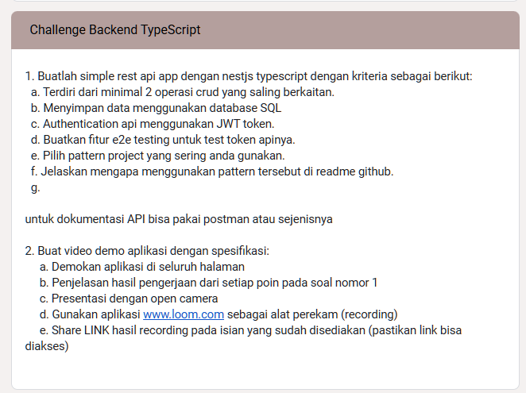

**Table Of Content**
- [Rest API with Nest framework TypeScript.](#rest-api-with-nest-framework-typescript)
    - [1. Buatlah simple rest api app dengan nestjs typescript dengan kriteria sebagai berikut:](#1-buatlah-simple-rest-api-app-dengan-nestjs-typescript-dengan-kriteria-sebagai-berikut)
    - [2. Buat video demo aplikasi dengan spesifikasi:](#2-buat-video-demo-aplikasi-dengan-spesifikasi)
  - [Pattern Project](#pattern-project)
- [📌 **Dokumentasi Struktur Proyek NestJS**](#-dokumentasi-struktur-proyek-nestjs)
  - [Full Structur Project](#full-structur-project)
  - [**🛠️ Design Pattern yang Digunakan**](#️-design-pattern-yang-digunakan)
    - [1️⃣ **Modular Monolith Architecture**](#1️⃣-modular-monolith-architecture)
    - [2️⃣ **Dependency Injection (DI)**](#2️⃣-dependency-injection-di)
    - [3️⃣ **Repository Pattern**](#3️⃣-repository-pattern)
    - [4️⃣ **Middleware \& Interceptor Pattern**](#4️⃣-middleware--interceptor-pattern)
  - [**📂 Penjelasan Tiap Folder**](#-penjelasan-tiap-folder)
    - [📁 `docs/` – Dokumentasi Proyek](#-docs--dokumentasi-proyek)
    - [📁 `prisma/` – Database Management](#-prisma--database-management)
    - [📁 `src/` – **Source Code Aplikasi**](#-src--source-code-aplikasi)
      - [📁 `common/` – **Utility dan Middleware**](#-common--utility-dan-middleware)
      - [📁 `modules/` – **Modular Structure**](#-modules--modular-structure)
    - [📁 `tests/` – **Unit \& Integration Testing**](#-tests--unit--integration-testing)
      - [📁 `jest/` – **Unit \& E2E Test dengan Jest**](#-jest--unit--e2e-test-dengan-jest)
      - [📁 `playwright/` – **Testing UI dengan Playwright**](#-playwright--testing-ui-dengan-playwright)
    - [📁 `views/` – **Halaman HTML untuk Frontend**](#-views--halaman-html-untuk-frontend)
    - [📁 **File Konfigurasi Utama**](#-file-konfigurasi-utama)
  - [**🔍 Kesimpulan**](#-kesimpulan)
  - [Project setup](#project-setup)
  - [Compile and run the project](#compile-and-run-the-project)
  - [Run tests](#run-tests)
  - [Playwright](#playwright)
    - [📥 1. Instalasi Playwright](#-1-instalasi-playwright)
    - [🚀 2. Menjalankan Test](#-2-menjalankan-test)
    - [🛠 3. Struktur Direktori tests](#-3-struktur-direktori-tests)
    - [🎯 4. Menjalankan Test dengan Reporter](#-4-menjalankan-test-dengan-reporter)
    - [🎭 5. Debugging](#-5-debugging)
    - [🔚 6. Note](#-6-note)
  - [Dokumentasi Challenge](#dokumentasi-challenge)
  - [Deployment](#deployment)
  - [Resources](#resources)
  - [Stay in touch](#stay-in-touch)
  - [License](#license)


<p align="center">
  <a href="http://nestjs.com/" target="blank"></a>
</p>

# Rest API with [Nest](https://github.com/nestjs/nest) framework TypeScript.

---

**Requierement** from Challenge Remote Internship at DOT Malang

### 1. Buatlah simple rest api app dengan nestjs typescript dengan kriteria sebagai berikut:

      a. Terdiri dari minimal 2 operasi crud yang saling berkaitan.
      b. Menyimpan data menggunakan database SQL
      c. Authentication api menggunakan JWT token.
      d. Buatkan fitur e2e testing untuk test token apinya.
      e. Pilih pattern project yang sering anda gunakan.
      f. Jelaskan mengapa menggunakan pattern tersebut di readme github.

`untuk dokumentasi API bisa pakai postman atau sejenisnya`

### 2. Buat video demo aplikasi dengan spesifikasi:

     a. Demokan aplikasi di seluruh halaman
     b. Penjelasan hasil pengerjaan dari setiap poin pada soal nomor 1
     c. Presentasi dengan open camera
     d. Gunakan aplikasi www.loom.com sebagai alat perekam (recording)
     e. Share LINK hasil recording pada isian yang sudah disediakan (pastikan link bisa diakses)

---

## Pattern Project

# 📌 **Dokumentasi Struktur Proyek NestJS**  

## Full Structur Project
```
└── 📁Final Nest JS
    └── 📁docs
        └── 📁auth
            └── AuthController.md
            └── AuthService.md
        └── challenge.png
        └── 📁nestjs
            └── dto.md
            └── guard.md
            └── interceptor.md
            └── structure.md
        └── 📁test
            └── 📁jest
                └── mock.md
            └── README.md
    └── 📁prisma
        └── 📁migrations
            └── 📁20250201133230_create_table_users
                └── migration.sql
            └── 📁20250201164458_modify_field_email_to_be_unique
                └── migration.sql
            └── 📁20250202060043_create_model_products_and_change_name_model_user_to_users
                └── migration.sql
            └── 📁20250202060545_adding_field_price_product
                └── migration.sql
            └── migration_lock.toml
        └── schema.prisma
    └── 📁src
        └── app.controller.spec.ts
        └── app.controller.ts
        └── app.module.ts
        └── app.service.ts
        └── 📁common
            └── authcookie.guard.ts
            └── example.interceptor.ts
            └── http-exception.filter.ts
            └── response-api.dto.ts
        └── main.ts
        └── 📁modules
            └── 📁auth
                └── auth.controller.spec.ts
                └── auth.controller.ts
                └── auth.dto.ts
                └── auth.module.ts
                └── auth.service.ts
            └── 📁prisma
                └── prisma.module.ts
                └── prisma.service.ts
            └── 📁product
                └── product.controller.spec.ts
                └── product.controller.ts
                └── product.entity.ts
                └── product.module.ts
                └── product.service.ts
            └── 📁user
                └── user.controller.ts
                └── user.dto.ts
                └── user.module.ts
                └── user.service.ts
    └── 📁tests
        └── 📁jest
            └── app.e2e-spec.ts
            └── auth.e2e-spec.ts
            └── jest-e2e.json
        └── 📁playwright
            └── auth.spec.ts
    └── 📁views
        └── hello.html
        └── index.html
        └── login.html
        └── register.html
    └── .env
    └── .env.development
    └── .env.test
    └── .gitignore
    └── eslint.config.mjs
    └── nest-cli.json
    └── package-lock.json
    └── package.json
    └── playwright.config.ts
    └── README.md
    └── tsconfig.build.json
    └── tsconfig.json
```

---

## **🛠️ Design Pattern yang Digunakan**  

### 1️⃣ **Modular Monolith Architecture**  
- Struktur ini membagi aplikasi menjadi **beberapa module**, masing-masing menangani fitur spesifik, seperti **auth**, **product**, dan **user**.  
- Setiap module memiliki **controller, service, dan DTO**, sehingga **mudah diperluas dan dikelola**.  

### 2️⃣ **Dependency Injection (DI)**  
- **NestJS menggunakan DI** untuk mengelola ketergantungan antara service dan repository.  
- Contoh: `auth.service.ts` tidak membuat instance `PrismaService` secara langsung, melainkan mendapatkannya dari **DI Container**.  

### 3️⃣ **Repository Pattern**  
- Digunakan dalam `prisma.service.ts` untuk mengakses database.  
- **Memisahkan logika bisnis dari akses database**, membuat kode lebih bersih dan terstruktur.  

### 4️⃣ **Middleware & Interceptor Pattern**  
- **Middleware** (`authcookie.guard.ts`) untuk memproses request sebelum masuk ke controller.  
- **Interceptor** (`example.interceptor.ts`) untuk memodifikasi response sebelum dikirim ke client.  

---

## **📂 Penjelasan Tiap Folder**  

### 📁 `docs/` – Dokumentasi Proyek  
> Berisi catatan tentang berbagai aspek proyek, termasuk **auth, DTO, guard, interceptor**, dan **struktur proyek**.  

- 📁 `auth/` – Dokumentasi **AuthController** dan **AuthService**.  
- 📁 `nestjs/` – Dokumentasi tentang berbagai fitur **NestJS**, seperti **DTO, Guard, dan Interceptor**.  
- 📁 `test/` – Dokumentasi terkait **unit test dan e2e test**.  

📌 **Kelebihan:**  
✅ Memudahkan pengembang dalam memahami dan mengembangkan proyek.  
✅ Dokumentasi **terorganisir** berdasarkan fitur dan komponen.  

---

### 📁 `prisma/` – Database Management  
> Berisi skema database dan file migrasi untuk **PostgreSQL** menggunakan **Prisma ORM**.  

- 📁 `migrations/` – Berisi **script migrasi database** untuk melacak perubahan struktur tabel.  
- `schema.prisma` – **Definisi skema database**, termasuk model **users** dan **products**.  

📌 **Kelebihan:**  
✅ **Database Schema as Code** – Semua perubahan database terdokumentasi dan bisa di-rollback.  
✅ **Mudah digunakan dengan TypeScript** berkat integrasi Prisma.  

---

### 📁 `src/` – **Source Code Aplikasi**  
> Folder utama yang berisi **logika aplikasi**, termasuk controller, service, DTO, dan middleware.  

#### 📁 `common/` – **Utility dan Middleware**  
- `authcookie.guard.ts` – Guard untuk **autentikasi** menggunakan cookie.  
- `example.interceptor.ts` – Interceptor untuk **memodifikasi response API**.  
- `http-exception.filter.ts` – Filter untuk menangani **error global**.  
- `response-api.dto.ts` – Data Transfer Object (DTO) untuk **struktur response API**.  

📌 **Kelebihan:**  
✅ **Reusable components** – Middleware dan utility bisa digunakan di seluruh aplikasi.  
✅ **Centralized error handling** – **Memudahkan debugging** dan meningkatkan keamanan.  

#### 📁 `modules/` – **Modular Structure**  
> Setiap module adalah **unit independen**, yang memiliki controller, service, DTO, dan konfigurasi sendiri.  

📌 **Modul yang ada:**  
1. 📁 `auth/` – **Manajemen autentikasi pengguna**.  
   - `auth.controller.ts` – Menangani request dari **client**.  
   - `auth.service.ts` – Logika autentikasi dan JWT.  
   - `auth.dto.ts` – DTO untuk validasi input.  
2. 📁 `prisma/` – **Database Service**.  
   - `prisma.service.ts` – Menyediakan akses ke database.  
3. 📁 `product/` – **Manajemen produk**.  
   - `product.controller.ts` – Menangani request **produk**.  
   - `product.service.ts` – Logika bisnis produk.  
4. 📁 `user/` – **Manajemen pengguna**.  
   - `user.controller.ts` – Menangani request pengguna.  
   - `user.service.ts` – Logika bisnis pengguna.  

📌 **Kelebihan:**  
✅ **Mudah dikembangkan** – Modul dapat ditambahkan tanpa mengganggu kode lain.  
✅ **High Cohesion & Low Coupling** – Modul saling **terpisah**, sehingga lebih terstruktur.  

---

### 📁 `tests/` – **Unit & Integration Testing**  
> Berisi **unit test dan e2e test** untuk menguji fungsionalitas aplikasi.  

#### 📁 `jest/` – **Unit & E2E Test dengan Jest**  
- `app.e2e-spec.ts` – **End-to-end testing** untuk aplikasi utama.  
- `auth.e2e-spec.ts` – **End-to-end testing** untuk autentikasi.  
- `jest-e2e.json` – Konfigurasi **Jest** untuk E2E test.  

#### 📁 `playwright/` – **Testing UI dengan Playwright**  
- `auth.spec.ts` – **Test autentikasi menggunakan Playwright**.  

📌 **Kelebihan:**  
✅ **Meningkatkan Keamanan** – Menghindari bug sebelum **deployment**.  
✅ **Automated Testing** – Memastikan **endpoint bekerja dengan baik**.  

---

### 📁 `views/` – **Halaman HTML untuk Frontend**  
> Berisi file **HTML statis** untuk tampilan sederhana.  

- `index.html` – Halaman utama.  
- `login.html` – Halaman login.  
- `register.html` – Halaman registrasi.  

📌 **Kelebihan:**  
✅ **Mempermudah debugging** jika ingin menguji endpoint tanpa frontend framework.  

---

### 📁 **File Konfigurasi Utama**  
> File yang digunakan untuk konfigurasi aplikasi.  

- `.env` – Konfigurasi **environment variables**.  
- `nest-cli.json` – Konfigurasi **NestJS CLI**.  
- `package.json` – **Dependency management** untuk proyek.  
- `tsconfig.json` – Konfigurasi **TypeScript**.  
- `eslint.config.mjs` – Konfigurasi **ESLint** untuk standarisasi kode.  

📌 **Kelebihan:**  
✅ **Memudahkan pengaturan environment dan dependency**.  
✅ **Membantu menjaga kualitas kode dengan linting**.  

---

## **🔍 Kesimpulan**  
Struktur proyek ini **modular dan terorganisir**, dengan beberapa **design pattern** utama:  
- **Modular Monolith** → Memudahkan pengelolaan fitur secara independen.  
- **Dependency Injection** → Mengurangi coupling dan meningkatkan skalabilitas.  
- **Repository Pattern** → Memisahkan logika bisnis dari database.  
- **Middleware & Interceptor** → Untuk validasi dan manipulasi request/response.  

Dengan struktur ini, proyek **mudah dikembangkan, diperluas, dan dikelola**, baik untuk **tim kecil maupun besar** 🚀.

## Project setup

```bash
$ npm install
```

## Compile and run the project

```bash
# development
$ npm run start

# watch mode
$ npm run start:dev

# production mode
$ npm run start:prod
```

## Run tests

```bash
# unit tests
$ npm run test

# e2e tests with jest
$ npm run test:e2e

# e2e tests with playwright
$ npm run test:pw

# test coverage
$ npm run test:cov
```

## Playwright
### 📥 1. Instalasi Playwright  
Jalankan perintah berikut di terminal:  

```sh
npm install -D @playwright/test
npx playwright install chromium
```

📌 **Catatan:**  
- `@playwright/test` adalah framework testing bawaan dari Playwright.  
- `npx playwright install chromium` hanya mengunduh Chromium (bisa juga `firefox` atau `webkit`).  

---

### 🚀 2. Menjalankan Test  
Gunakan perintah ini untuk menjalankan semua test:  

```sh
npx playwright test
```

Atau untuk menjalankan **test dalam mode terminal saja** (tanpa membuka browser GUI):  

```sh
npx playwright test --ui=none
```

Untuk menjalankan **test tertentu**, misalnya file `auth.spec.ts`:  

```sh
npx playwright test tests/auth.spec.ts
```

---

### 🛠 3. Struktur Direktori tests

```
└── 📁tests
    └── 📁jest
        └── app.e2e-spec.ts
        └── auth.e2e-spec.ts
        └── jest-e2e.json
    └── 📁playwright
        └── auth.spec.ts
```

---

### 🎯 4. Menjalankan Test dengan Reporter  

Untuk menjalankan test dan melihat hasilnya dalam format list:  

```sh
npx playwright test --reporter=list
```

Untuk menghasilkan laporan HTML (bisa dibuka di browser):  

```sh
npx playwright test --reporter=html
```

Buka laporan dengan:  

```sh
npx playwright show-report
```

---

### 🎭 5. Debugging  

Untuk **menjalankan test dengan debugging mode**:  

```sh
npx playwright test --debug
```

Untuk **merekam tindakan** di Playwright:  

```sh
npx playwright codegen http://localhost:4000
```


### 🔚 6. Note  
- **Playwright bisa digunakan untuk menguji API & autentikasi berbasis cookie.**  
- **Test harus meniru skenario user asli** seperti login & akses endpoint yang dilindungi.  
- **Gunakan debugging tools jika ada masalah dengan test.**  

🚀 **Happy Testing!**  


## Dokumentasi Challenge



## Deployment

When you're ready to deploy your NestJS application to production, there are some key steps you can take to ensure it runs as efficiently as possible. Check out the [deployment documentation](https://docs.nestjs.com/deployment) for more information.

If you are looking for a cloud-based platform to deploy your NestJS application, check out [Mau](https://mau.nestjs.com), our official platform for deploying NestJS applications on AWS. Mau makes deployment straightforward and fast, requiring just a few simple steps:

```bash
$ npm install -g mau
$ mau deploy
```

With Mau, you can deploy your application in just a few clicks, allowing you to focus on building features rather than managing infrastructure.

## Resources

Check out a few resources that may come in handy when working with NestJS:

- Visit the [NestJS Documentation](https://docs.nestjs.com) to learn more about the framework.
- For questions and support, please visit our [Discord channel](https://discord.gg/G7Qnnhy).
- To dive deeper and get more hands-on experience, check out our official video [courses](https://courses.nestjs.com/).
- Deploy your application to AWS with the help of [NestJS Mau](https://mau.nestjs.com) in just a few clicks.
- Visualize your application graph and interact with the NestJS application in real-time using [NestJS Devtools](https://devtools.nestjs.com).
- Need help with your project (part-time to full-time)? Check out our official [enterprise support](https://enterprise.nestjs.com).
- To stay in the loop and get updates, follow us on [X](https://x.com/nestframework) and [LinkedIn](https://linkedin.com/company/nestjs).
- Looking for a job, or have a job to offer? Check out our official [Jobs board](https://jobs.nestjs.com).

## Stay in touch

- Author - [Abya Laxx](https://github.com/abyalax)
- Website - [https://profile-abya](https://profile-abya.vercel.app/)
- Instagram - [abya.xc](https://instagram.com/abya.xc)

## License

Nest is [MIT licensed](https://github.com/nestjs/nest/blob/master/LICENSE).
