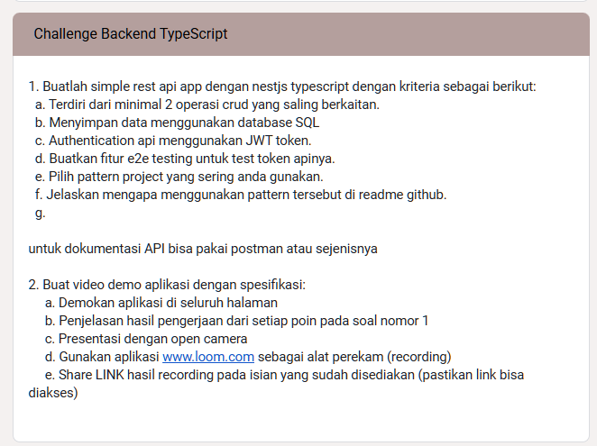

## Read The Documentation
**Table Of Content**
- [Rest API with Nest framework TypeScript.](#rest-api-with-nest-framework-typescript)
    - [1. Buatlah simple rest api app dengan nestjs typescript dengan kriteria sebagai berikut:](#1-buatlah-simple-rest-api-app-dengan-nestjs-typescript-dengan-kriteria-sebagai-berikut)
    - [2. Buat video demo aplikasi dengan spesifikasi:](#2-buat-video-demo-aplikasi-dengan-spesifikasi)
  - [Pattern Project](#pattern-project)
- [📌 **Dokumentasi Struktur Proyek NestJS**](#-dokumentasi-struktur-proyek-nestjs)
  - [Full Structur Project](#full-structur-project)
  - [**⚒️ Design Pattern yang Digunakan**](#️-design-pattern-yang-digunakan)
    - [1️⃣ **Design Pattern yang digunakan berdasarkan struktur folder**](#1️⃣-design-pattern-yang-digunakan-berdasarkan-struktur-folder)
    - [2️⃣ **Dependency Injection (DI)**](#2️⃣-dependency-injection-di)
    - [3️⃣ **Middleware**](#3️⃣-middleware)
    - [4️⃣ **Interceptor**](#4️⃣-interceptor)
    - [5️⃣ **Guard**](#5️⃣-guard)
    - [6️⃣ **Filter**](#6️⃣-filter)
    - [7️⃣ **Validation**](#7️⃣-validation)
    - [8️⃣ **Pipe**](#8️⃣-pipe)
  - [**📂 Penjelasan Tiap Folder**](#-penjelasan-tiap-folder)
    - [📁 **.github/workflows/** – CI/CD Pipeline](#-githubworkflows--cicd-pipeline)
    - [📁 **prisma/** – Database Management](#-prisma--database-management)
    - [📁 **src/** – **Source Code Aplikasi**](#-src--source-code-aplikasi)
      - [📁 **common/** – Modul yang digunakan di seluruh aplikasi](#-common--modul-yang-digunakan-di-seluruh-aplikasi)
      - [📁 **modules/** – Modular Structure](#-modules--modular-structure)
    - [📁 **tests/** – Unit \& Integration Testing](#-tests--unit--integration-testing)
    - [📁 **views/** – Halaman HTML untuk Frontend](#-views--halaman-html-untuk-frontend)
    - [📁 **File Konfigurasi Utama**](#-file-konfigurasi-utama)
  - [**🔍 Kesimpulan**](#-kesimpulan)
  - [Project setup](#project-setup)
  - [Compile and run the project](#compile-and-run-the-project)
  - [Run tests](#run-tests)
  - [Playwright](#playwright)
    - [📥 1. Instalasi Playwright](#-1-instalasi-playwright)
    - [🛠 3. Struktur Direktori tests](#-3-struktur-direktori-tests)
    - [🎯 4. Menjalankan Test dengan Reporter](#-4-menjalankan-test-dengan-reporter)
    - [🎭 5. Debugging](#-5-debugging)
    - [🔚 6. Note](#-6-note)
  - [Dokumentasi Challenge](#dokumentasi-challenge)
  - [Deployment](#deployment)
  - [Resources](#resources)
  - [Stay in touch](#stay-in-touch)
  - [License](#license)
---

<p align="center">
  <a href="http://nestjs.com/" target="blank"></a>
</p>

# Rest API with [Nest](https://github.com/nestjs/nest) framework TypeScript.

---

**Requierement** from Challenge Remote Internship at DOT Malang

### 1. Buatlah simple rest api app dengan nestjs typescript dengan kriteria sebagai berikut:

      a. Terdiri dari minimal 2 operasi crud yang saling berkaitan.
      b. Menyimpan data menggunakan database SQL
      c. Authentication api menggunakan JWT token.
      d. Buatkan fitur e2e testing untuk test token apinya.
      e. Pilih pattern project yang sering anda gunakan.
      f. Jelaskan mengapa menggunakan pattern tersebut di readme github.

`untuk dokumentasi API bisa pakai postman atau sejenisnya`

### 2. Buat video demo aplikasi dengan spesifikasi:

     a. Demokan aplikasi di seluruh halaman
     b. Penjelasan hasil pengerjaan dari setiap poin pada soal nomor 1
     c. Presentasi dengan open camera
     d. Gunakan aplikasi www.loom.com sebagai alat perekam (recording)
     e. Share LINK hasil recording pada isian yang sudah disediakan (pastikan link bisa diakses)

---

## Pattern Project

# 📌 **Dokumentasi Struktur Proyek NestJS**  

## Full Structur Project
```
└── 📁Final Nest JS
    └── 📁.github
        └── 📁workflows
            └── playwright.yml
    └── 📁prisma
    └── 📁src
        └── app.controller.spec.ts
        └── app.controller.ts
        └── app.module.ts
        └── app.service.ts
        └── 📁common
            └── 📁auth
                └── auth.middleware.spec.ts
                └── auth.middleware.ts
            └── 📁log
                └── log.middleware.spec.ts
                └── log.middleware.ts
            └── 📁prisma
                └── prisma.module.ts
                └── prisma.service.spec.ts
                └── prisma.service.ts
            └── 📁response
                └── response.interceptor.spec.ts
                └── response.interceptor.ts
                └── response.spec.ts
                └── response.ts
            └── 📁role
                └── role.decorator.ts
                └── role.guard.spec.ts
                └── role.guard.ts
            └── 📁validation
                └── validation.decorator.ts
                └── validation.filter.spec.ts
                └── validation.filter.ts
                └── validation.module.ts
                └── validation.pipe.spec.ts
                └── validation.pipe.ts
                └── validation.service.spec.ts
                └── validation.service.ts
        └── main.ts
        └── 📁models
            └── login.model.ts
        └── 📁modules
            └── 📁auth
                └── auth.controller.spec.ts
                └── auth.controller.ts
                └── auth.interface.ts
                └── auth.module.ts
                └── auth.service.spec.ts
                └── auth.service.ts
            └── 📁user
                └── user.controller.spec.ts
                └── user.controller.ts
                └── user.module.ts
                └── user.service.spec.ts
                └── user.service.ts
    └── 📁tests
    └── 📁views
        └── hello.html
        └── index.html
        └── login.html
        └── register.html
    └── .env
    └── .env.development
    └── .env.example
    └── .env.production
    └── .env.test
    └── .gitignore
    └── eslint.config.mjs
    └── nest-cli.json
    └── package-lock.json
    └── package.json
    └── playwright.config.ts
    └── README.md
    └── tsconfig.build.json
    └── tsconfig.json
```

---

## **⚒️ Design Pattern yang Digunakan**  

### 1️⃣ **Design Pattern yang digunakan berdasarkan struktur folder**    
Struktur proyek menggunakan pola **Modular Architecture**, yang membagi fitur ke dalam module independen. Setiap module memiliki controller, service, dan spesifikasinya sendiri.

### 2️⃣ **Dependency Injection (DI)**     
Menggunakan **NestJS Dependency Injection (DI)** untuk mengelola dependensi dan meningkatkan modularitas serta maintainability kode.

### 3️⃣ **Middleware**  
Middleware digunakan untuk menangani request sebelum mencapai controller. Contoh middleware yang digunakan:
- **auth.middleware.ts** – Menangani otentikasi pengguna.
- **log.middleware.ts** – Logging request dan response.

### 4️⃣ **Interceptor**  
Digunakan untuk memodifikasi request atau response sebelum dikirim ke client. Contoh:
- **response.interceptor.ts** – Menangani response standar aplikasi.

### 5️⃣ **Guard**  
Guard digunakan untuk mengatur otorisasi pengguna berdasarkan role:
- **role.guard.ts** – Memeriksa apakah pengguna memiliki akses ke endpoint tertentu.

### 6️⃣ **Filter**  
Digunakan untuk menangani error secara terpusat:
- **validation.filter.ts** – Menangani validasi request.

### 7️⃣ **Validation**  
Menggunakan **Validation Decorators** dan **Pipes** untuk validasi request:
- **validation.decorator.ts** – Custom decorator untuk validasi input.
- **validation.pipe.ts** – Memproses data sebelum dikirim ke controller.

### 8️⃣ **Pipe**  
Digunakan untuk memanipulasi data sebelum diproses oleh handler.
- **validation.pipe.ts** – Memvalidasi dan mengubah data sesuai aturan tertentu.

---

## **📂 Penjelasan Tiap Folder**  

### 📁 **.github/workflows/** – CI/CD Pipeline
> Berisi workflow untuk otomatisasi pengujian menggunakan **Playwright**.

---

### 📁 **prisma/** – Database Management  
> Menggunakan **Prisma ORM** untuk pengelolaan database PostgreSQL.

- **schema.prisma** – Definisi skema database.
- **migrations/** – Berisi script migrasi database.

📌 **Kelebihan:**  
✅ **Database Schema as Code** – Perubahan database terdokumentasi dan dapat di-rollback.  
✅ **TypeScript Integration** – Memudahkan penanganan query database.  

---

### 📁 **src/** – **Source Code Aplikasi**  
> Folder utama yang berisi logika aplikasi.

#### 📁 **common/** – Modul yang digunakan di seluruh aplikasi  
Berisi middleware, interceptor, filter, dan utility lainnya.
- 📁 **auth/** – Middleware otentikasi.
- 📁 **log/** – Middleware untuk logging request.
- 📁 **prisma/** – Service untuk database.
- 📁 **response/** – Interceptor untuk standar response.
- 📁 **role/** – Guard untuk role-based access.
- 📁 **validation/** – Validasi input request.

📌 **Kelebihan:**  
✅ **Reusable components** – Middleware dan utility dapat digunakan di seluruh aplikasi.  
✅ **Centralized error handling** – Memudahkan debugging dan meningkatkan keamanan.  

#### 📁 **modules/** – Modular Structure  
> Setiap module memiliki controller, service, dan spesifikasinya sendiri.

📌 **Modul yang ada:**  
1. 📁 **auth/** – Manajemen autentikasi pengguna.
   - **auth.controller.ts** – Menangani request dari client.
   - **auth.service.ts** – Logika autentikasi.
2. 📁 **user/** – Manajemen pengguna.
   - **user.controller.ts** – Menangani request pengguna.
   - **user.service.ts** – Logika pengguna.

📌 **Kelebihan:**  
✅ **Modular Architecture** – Setiap fitur terpisah dalam module.
✅ **High Cohesion & Low Coupling** – Mudah dikembangkan tanpa mempengaruhi fitur lain.

---

### 📁 **tests/** – Unit & Integration Testing  
> Berisi unit test dan e2e test untuk menguji fungsionalitas aplikasi.

📌 **Kelebihan:**  
✅ **Mencegah regresi** – Memastikan fitur tetap bekerja setelah perubahan kode.
✅ **Automated Testing** – Mempercepat pengujian dengan CI/CD.

---

### 📁 **views/** – Halaman HTML untuk Frontend  
> Berisi file **HTML statis** untuk tampilan sederhana.

📌 **Kelebihan:**  
✅ **Render cepat** – Tidak memerlukan rendering dari backend.
✅ **Dapat digunakan untuk halaman fallback sederhana.**

---

### 📁 **File Konfigurasi Utama**  
> File yang digunakan untuk konfigurasi aplikasi.

- **.env** – Konfigurasi **environment variables**.
- **nest-cli.json** – Konfigurasi **NestJS CLI**.
- **package.json** – Konfigurasi dependensi proyek.
- **playwright.config.ts** – Konfigurasi Playwright untuk testing UI.

📌 **Kelebihan:**  
✅ **Konfigurasi yang jelas** – Mudah mengubah pengaturan tanpa mengedit kode.
✅ **Environment separation** – Dapat mengatur konfigurasi berbeda untuk development dan production.

---

## **🔍 Kesimpulan**  

Proyek ini menggunakan **NestJS** dengan **Modular Architecture**, **Dependency Injection**, serta **Testing (Jest & Playwright)** untuk memastikan kualitas kode. Dengan struktur yang terorganisir, proyek ini mudah untuk dikembangkan dan dipelihara. 🚀


## Project setup

```bash
$ npm install
```

## Compile and run the project

```bash
# start hasil build
$ npm run start

# watch mode
$ npm run start:dev

# production mode
$ npm run start:prod
```

## Run tests

```bash
# unit tests & end to end test with playwright
$ npm run test

# e2e tests with jest, but not use in this projects
$ npm run test:e2e

# e2e tests with playwright
$ npm run test:playwright

# test coverage
$ npm run test:cov
```

## Playwright
### 📥 1. Instalasi Playwright  
Jalankan perintah berikut di terminal:  

```sh
npm install -D @playwright/test
npx playwright install chromium
```

---

### 🛠 3. Struktur Direktori tests

```
└── 📁tests
    └── 📁jest
        └── app.e2e-spec.ts
        └── jest-e2e.json
    └── 📁playwright
        └── auth.spec.ts
```

---

### 🎯 4. Menjalankan Test dengan Reporter  

Untuk menjalankan test dan melihat hasilnya dalam format list:  

```sh
npx playwright test --reporter=list
```

Untuk menghasilkan laporan HTML (bisa dibuka di browser):  

```sh
npx playwright test --reporter=html
```

Buka laporan dengan:  

```sh
npx playwright show-report
```

---

### 🎭 5. Debugging  

Untuk **menjalankan test dengan debugging mode**:  

```sh
npx playwright test --debug
```

Untuk **merekam tindakan** di Playwright:  

```sh
npx playwright codegen http://localhost:4000
```

### 🔚 6. Note  
- **Playwright bisa digunakan untuk menguji API & autentikasi berbasis cookie.**  
- **Test harus meniru skenario user asli** seperti login & akses endpoint yang dilindungi.  
- **Gunakan debugging tools jika ada masalah dengan test.**  

🚀 **Happy Testing!**  


## Dokumentasi Challenge



## Deployment

When you're ready to deploy your NestJS application to production, there are some key steps you can take to ensure it runs as efficiently as possible. Check out the [deployment documentation](https://docs.nestjs.com/deployment) for more information.

If you are looking for a cloud-based platform to deploy your NestJS application, check out [Mau](https://mau.nestjs.com), our official platform for deploying NestJS applications on AWS. Mau makes deployment straightforward and fast, requiring just a few simple steps:

```bash
$ npm install -g mau
$ mau deploy
```

With Mau, you can deploy your application in just a few clicks, allowing you to focus on building features rather than managing infrastructure.

## Resources

Check out a few resources that may come in handy when working with NestJS:

- Visit the [NestJS Documentation](https://docs.nestjs.com) to learn more about the framework.
- For questions and support, please visit our [Discord channel](https://discord.gg/G7Qnnhy).
- To dive deeper and get more hands-on experience, check out our official video [courses](https://courses.nestjs.com/).
- Deploy your application to AWS with the help of [NestJS Mau](https://mau.nestjs.com) in just a few clicks.
- Visualize your application graph and interact with the NestJS application in real-time using [NestJS Devtools](https://devtools.nestjs.com).
- Need help with your project (part-time to full-time)? Check out our official [enterprise support](https://enterprise.nestjs.com).
- To stay in the loop and get updates, follow us on [X](https://x.com/nestframework) and [LinkedIn](https://linkedin.com/company/nestjs).
- Looking for a job, or have a job to offer? Check out our official [Jobs board](https://jobs.nestjs.com).

## Stay in touch

- Author - [Abya Laxx](https://github.com/abyalax)
- Website - [https://profile-abya](https://profile-abya.vercel.app/)
- Instagram - [abya.xc](https://instagram.com/abya.xc)

## License

Nest is [MIT licensed](https://github.com/nestjs/nest/blob/master/LICENSE).
